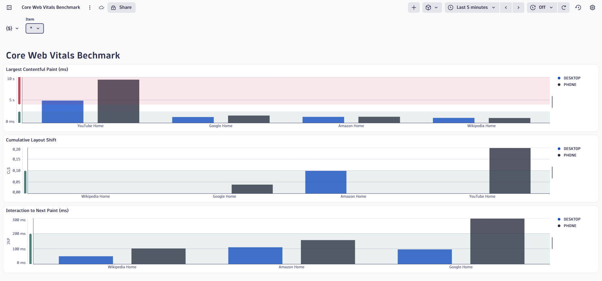

# Chrome UX Report (CrUX) data ingest with Dynatrace

Monitor real user experience metrics from Google's Chrome UX Report directly in Dynatrace. This workflow automatically collects Core Web Vitals data and ingests it as custom metrics.

## Overview

This Dynatrace workflow queries the [Chrome UX Report API](https://developer.chrome.com/docs/crux/api) to retrieve Core Web Vitals metrics (LCP, CLS, INP) for specified URLs and ingests them into Dynatrace for monitoring and benchmarking.


example of visualization [Core Web Vitals Benchmark.json](Core%20Web%20Vitals%20Benchmark.json)

## Prerequisites

- Dynatrace environment with Workflows enabled
- Google Cloud Project with CrUX API enabled
- Google API Key with CrUX API access

## Setup Instructions

### 1. Create Google API Key

1. Go to [Google Cloud Console](https://console.cloud.google.com/)
2. Create or select a project
3. Enable the Chrome UX Report API
4. Navigate to **APIs & Services > Credentials**
5. Create an API Key
6. Copy the API key for later use

**Documentation**: [CrUX API - Get Started](https://developer.chrome.com/docs/crux/api#api-key)

### 2. Configure Dynatrace Credentials Vault

1. In Dynatrace, go to app **Credentials Vault**
2. Create a new **Token** credential
3. Paste your Google API Key
4. Save and copy the **Credential ID**

### 3. Import Workflow

1. Download the workflow files from this repository: [chromeux---getdata.workflow-template.yaml](chromeux---getdata.workflow-template.yaml)
2. In Dynatrace, go to **Workflows**
3. Import the workflow
4. Update `Settings.ts` section:
   - Replace `CRUX_TOKEN_CRED_ID` with your credential ID
   - Customize `MONITORED_URLS` array with urls you're interested in getting CVW data

Example configuration:

```typescript
public static CRUX_TOKEN_CRED_ID = "CREDENTIALS_VAULT-YOUR_ID_HERE";

public static MONITORED_URLS = [
  { url: "https://www.google.com", friendlyName: "Google_Home" },
  { url: "https://www.wikipedia.org", friendlyName: "Wikipedia_Home" },
  { url: "https://www.amazon.com", friendlyName: "Amazon_Home" },
  { url: "https://www.youtube.com", friendlyName: "YouTube_Home" }
];
```

### 4. Import Dashboard

1. Import the `Core_Web_Vitals_Benchmark.json` dashboard
2. The dashboard will display metrics for all monitored URLs

## Metrics Collected

| Metric | Description | Unit | Good Threshold |
|--------|-------------|------|----------------|
| **LCP** (Largest Contentful Paint) | Loading performance | ms | ≤ 2500ms |
| **CLS** (Cumulative Layout Shift) | Visual stability | ratio | ≤ 0.1 |
| **INP** (Interaction to Next Paint) | Responsiveness | ms | ≤ 200ms |

All metrics are collected at **P75** (75th percentile) for both **PHONE** and **DESKTOP** form factors.

## Metric Format

Metrics are ingested with the following dimensions:
- `domain`: Website domain
- `formfactor`: PHONE or DESKTOP
- `friendlyname`: Custom site identifier
- `site`: URL (sanitized)

**Documentation**: [Core Web Vitals](https://web.dev/vitals/)

## Scheduling

Configure the workflow schedule in Dynatrace Workflows settings. Recommended: daily execution.

## Troubleshooting

Check workflow logs in Dynatrace for detailed execution information. All operations are logged with structured data.
Logs are also sent to grail, use this query to filter wokflow logs with a subset of meaningful fields:

```
fetch logs
| filter log.source == "ChromeUX Ingestor"
| fields timestamp, status, content, details.actualpayloadline, details.metrics, details.errorbody.linesok, details.errorbody.error.invalidlines, details.errorbody.error.code
| sort timestamp desc
```

## References

- [Chrome UX Report API Documentation](https://developer.chrome.com/docs/crux/api)
- [CrUX API Query Examples](https://developer.chrome.com/docs/crux/api#example_queries)
- [Web Vitals](https://web.dev/vitals/)
- [Dynatrace Metrics Ingestion](https://docs.dynatrace.com/docs/dynatrace-api/environment-api/metric-v2/post-ingest-metrics)
